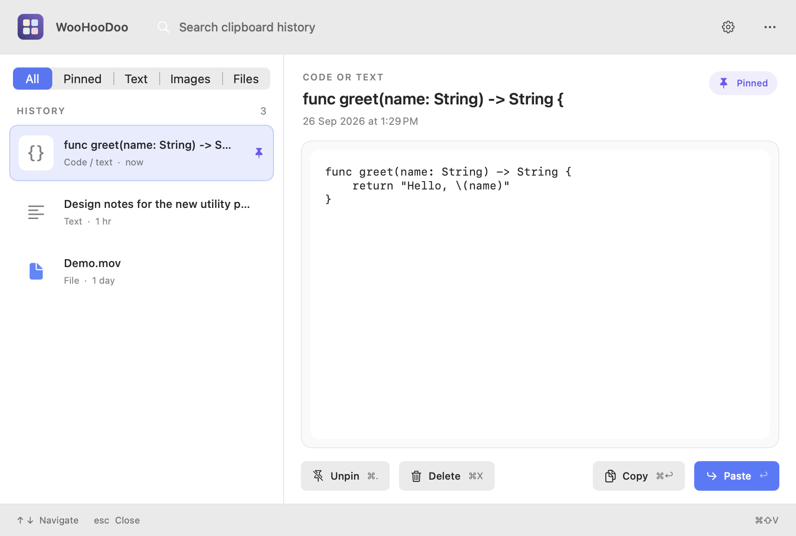
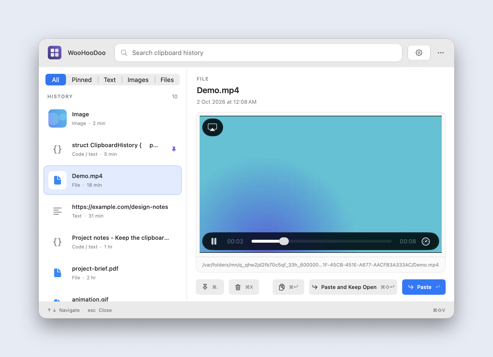
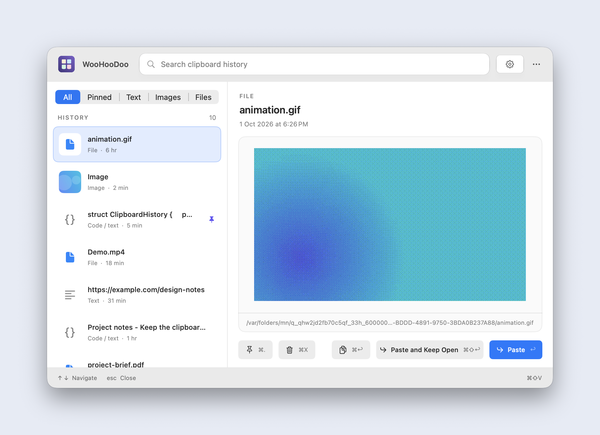
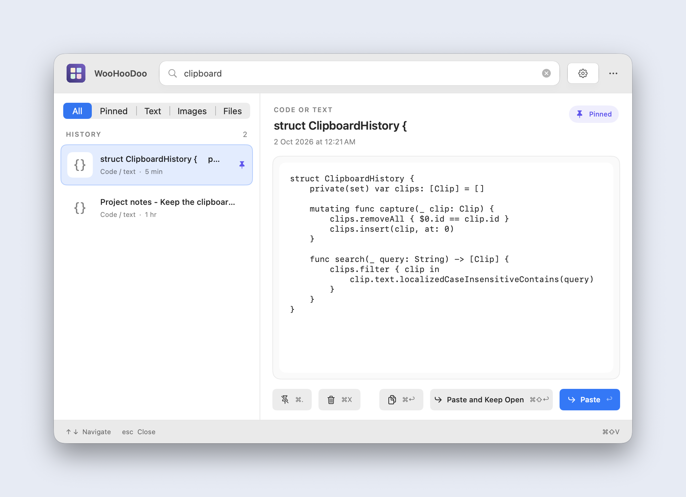
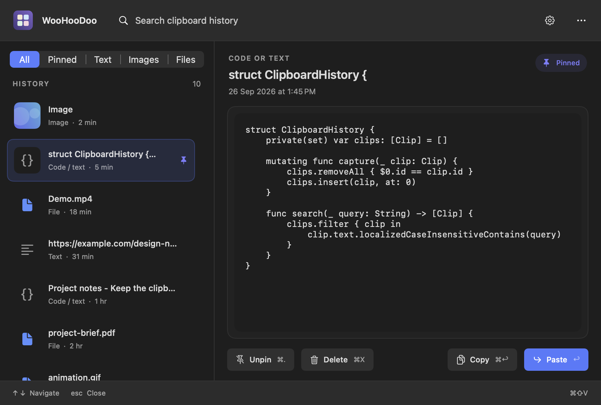
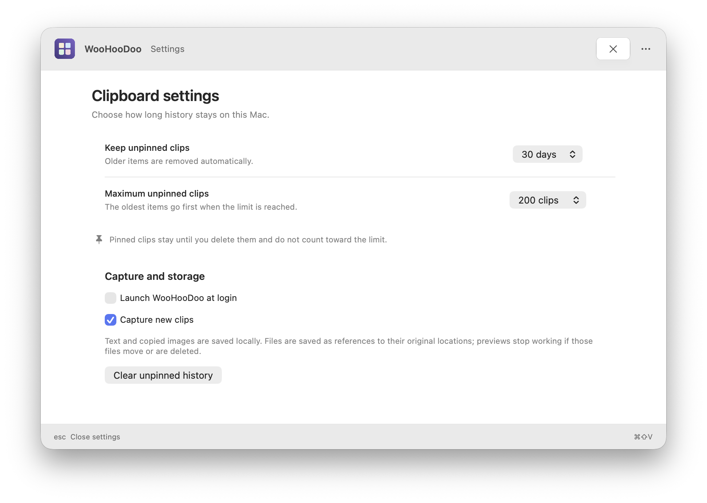

# WooHooDoo

WooHooDoo is a free, open-source macOS menu bar app for clipboard history. Search and preview what you copied, then paste it back with a keyboard shortcut. It is built with SwiftUI and AppKit and keeps history on your Mac.



| Video playing with native controls | GIF preview |
| --- | --- |
|  |  |

| Search and pinned clips | Dark appearance |
| --- | --- |
|  |  |



## Why I built this

Raycast used more memory than I wanted when clipboard history was the only feature I used. The clipboard apps I liked cost around $15, so I built my own and made it free and open source. I called it WooHooDoo because I may add other small utilities later.

## What it does

- Captures text, images, and files. The latest copied item appears first.
- Searches text and filenames, with filters for pinned items, text, images, and files.
- Previews text and code directly, plays common video files with native controls, animates GIFs when their GIF data is available, and uses macOS Quick Look for other supported files. Copied file groups stay together.
- Pins clips, sets retention limits, and pauses capture from settings.
- Runs from the menu bar. Launch at login is optional and off by default.

The app has no account, subscription, network calls, or third-party packages.

## Size and memory

The release app bundle is **1.9 MB on disk**. In a local measurement on Apple silicon with macOS 27.0, the menu bar app had 14 saved clips and its panel was closed. After one minute, `vmmap -summary` reported a **69.6 MB physical footprint**; `ps` reported **114 MB resident memory (RSS)**. This was measured on 26 September 2026. Memory use can change with history size and open media previews.

## Install

You need macOS 14 or later, Apple's Swift command-line tools, and Python 3. From this repository, run:

```sh
./scripts/install-app.sh
```

The script builds an ad hoc signed app, installs it at `~/Applications/WooHooDoo.app`, and opens it. Quit WooHooDoo before running the script again to update it. The app appears in the menu bar, not the Dock. You can also open it from `~/Applications`.

For a build without installation, run `./scripts/build-app.sh` and open `dist/WooHooDoo.app`.

## Use

Press `Command-Shift-V` or click the WooHooDoo menu bar icon. Search, use the filters, and select a clip with the arrow keys. Copying or pasting a saved clip moves it to the top and refreshes its retention date.

| Shortcut | Action |
| --- | --- |
| `Command-Shift-V` | Open or close WooHooDoo |
| `Up` / `Down` | Move through results |
| `Return` | Paste the selected clip |
| `Command-Return` | Copy the selected clip |
| `Command-.` | Pin or unpin the selected clip |
| `Command-X` | Delete the selected clip |
| `Escape` | Close the panel or settings |

Double-clicking a result also pastes it. Automatic paste needs macOS Accessibility access. Without it, WooHooDoo puts the clip on the clipboard and asks for access; you can paste manually.

GIF files play automatically in the preview. Copied GIF images also play when the source app puts the original GIF data on the clipboard. If it only supplies a still image, WooHooDoo cannot recover the animation.

Open the gear button to change retention and capture settings. To start the app when you sign in, enable **Launch WooHooDoo at login** there. macOS may ask you to approve the login item in System Settings. Keep the installed app in `~/Applications` while this setting is enabled.

## Retention and privacy

Unpinned history defaults to **30 days** and **200 clips**. Settings offer other limits, including Forever and Unlimited. Pinned clips stay until you delete them. WooHooDoo applies limits when it captures a clip, starts, or changes settings, and about once an hour while running.

History lives in `~/Library/Application Support/WooHooDoo`. Text and copied images are saved there. Files are saved as paths to the originals, so their previews stop working if the originals move or are deleted. Text over 1 MB, images over 10 MB, and clipboard entries marked concealed or transient are skipped. The stored history is not encrypted; anyone with access to your macOS account can read it.

## Uninstall

Turn off **Launch WooHooDoo at login** in settings, quit the app from its `...` menu, and move `~/Applications/WooHooDoo.app` to Trash. To erase saved history and settings, also delete `~/Library/Application Support/WooHooDoo`. The local `dist/` build and repository can be removed separately.

## Development

| Command | Purpose |
| --- | --- |
| `./scripts/build-app.sh` | Build and sign `dist/WooHooDoo.app` locally |
| `./scripts/check.sh` | Run clipboard storage checks |
| `./scripts/check-layout.sh` | Render sample screens to `.build/layout-*.png` |

Read [architecture](docs/ARCHITECTURE.md) for the app's data flow and storage, and [contributing](CONTRIBUTING.md) before sending a change. The screenshots above come from `./scripts/check-layout.sh`, which captures a real 860 x 580 point sample window with its corners and shadow. On macOS 26 and later, header controls use Liquid Glass; earlier systems use standard controls.

## License

[MIT](LICENSE) © 2026 Vaibhav Acharya.
